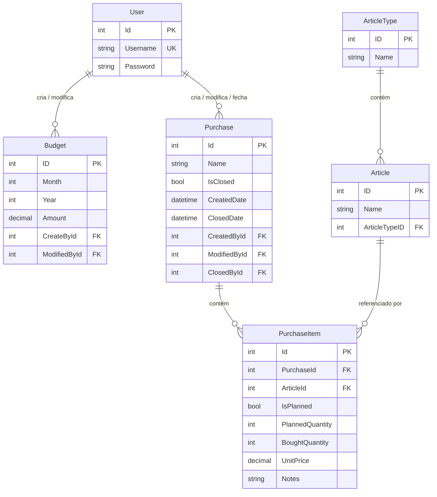

# 🛒 iShopping — Gestão de Compras e Orçamentos

> **Aplicação Desktop Windows Forms** para gestão de artigos, categorias, orçamentos mensais e compras, desenvolvida em C# com .NET 10 e Entity Framework Core.

---

## 📋 Sobre o Projeto

O **iShopping** é uma aplicação de gestão de compras e orçamentos pessoais/empresariais construída com Windows Forms. Permite aos utilizadores organizar artigos por categorias, definir orçamentos mensais, criar listas de compras e acompanhar os gastos com itens individuais.

O projeto segue uma arquitetura **MVC (Model-View-Controller)** adaptada para Windows Forms, com separação clara entre modelos de dados, controladores de lógica de negócio e formulários de apresentação.

---

## 🏗️ Arquitetura

O projeto utiliza uma arquitetura **MVC** adaptada para WinForms:

```
Projeto_DA/
├── Models/            # Entidades de dados (EF Core)
│   ├── Article.cs
│   ├── ArticleType.cs
│   ├── Budget.cs
│   ├── Purchase.cs
│   ├── PurchaseItem.cs
│   └── User.cs
│
├── Controllers/       # Lógica de negócio
│   ├── ArticleController.cs
│   ├── ArticleTypeController.cs
│   ├── AuthController.cs
│   ├── BudgetController.cs
│   ├── PurchaseController.cs
│   └── PurchaseItemController.cs
│
├── Views/             # Formulários WinForms (UI)
│   ├── LoginForm.cs
│   ├── CategoriesForm.cs
│   ├── ArticlesForm.cs
│   ├── BudgetsForm.cs
│   ├── PurchasesForm.cs
│   └── PurchaseDetailsForm.cs
│
├── Data/              # Contexto de base de dados
│   └── AppDbContext.cs
│
├── Migrations/        # Migrações EF Core
├── MainForm.cs        # Dashboard principal
├── SessionManager.cs  # Gestão de sessão do utilizador
└── Program.cs         # Ponto de entrada da aplicação
```

---

## 🗄️ Modelo de Dados



---

## 🛠️ Tecnologias

| Tecnologia | Versão |
|---|---|
| **C#** | .NET 10.0 |
| **Windows Forms** | WinForms (.NET) |
| **Entity Framework Core** | 10.0.8 |
| **SQL Server** | LocalDB (MSSQLLocalDB) |
| **IDE** | Visual Studio 2022+ |

---

## 🚀 Como Executar

### Pré-requisitos

- [.NET 10 SDK](https://dotnet.microsoft.com/download/dotnet/10.0)
- [Visual Studio 2022+](https://visualstudio.microsoft.com/) com workload **".NET Desktop Development"**
- SQL Server LocalDB (incluído com o Visual Studio)

### Passos

1. **Clonar o repositório:**
   ```bash
   git clone https://github.com/Stalker0566/Projeto_DA-AAN.git
   cd Projeto_DA-AAN
   ```

2. **Abrir a solução** no Visual Studio:
   ```
   Projeto_DA.slnx
   ```

3. **Restaurar pacotes NuGet** (automático no Visual Studio, ou via terminal):
   ```bash
   dotnet restore
   ```

4. **Executar a aplicação:**
   - Pressionar `F5` no Visual Studio, ou:
   ```bash
   dotnet run --project Projeto_DA
   ```

5. **Login padrão:**
   | Utilizador | Palavra-passe |
   |---|---|
   | `admin` | `123` |

   > ⚠️ A base de dados é criada automaticamente na primeira execução via `EnsureCreated()`.

---

## 📸 Ecrãs da Aplicação

| Ecrã | Descrição |
|---|---|
| **Login** | Autenticação de utilizador com validação |
| **Dashboard** | Painel principal com lista de compras abertas |
| **Categorias** | Gestão de categorias de artigos (CRUD completo) |
| **Artigos** | Gestão de artigos com filtragem por categoria |
| **Orçamentos** | Gestão de orçamentos mensais com prevenção de duplicados |
| **Compras** | Criar, fechar e gerir listas de compras |
| **Detalhes da Compra** | Adicionar itens a uma compra com quantidade e preço |

---

## 👥 Autores

- **Projeto DA — AAN**

---

## 📄 Licença

Este projeto é desenvolvido para fins académicos.

---

## 🔮 Melhorias Futuras

- [ ] Implementar gestão de utilizadores
- [ ] Implementar ecrã de estatísticas e relatórios
- [ ] Adicionar cálculo automático de totais nas compras
- [ ] Comparação orçamento vs. gastos reais
- [ ] Implementar hash de palavras-passe
- [ ] Adicionar validação de inputs nos formulários
- [ ] Suporte para exportação de dados (CSV/PDF)
